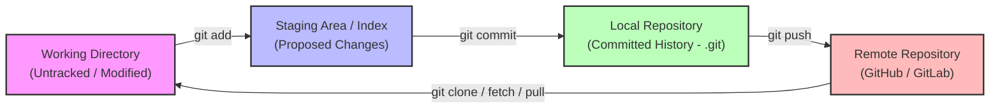
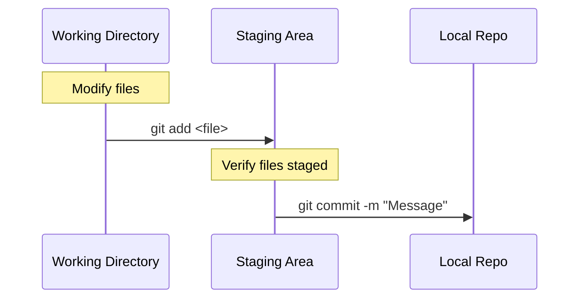
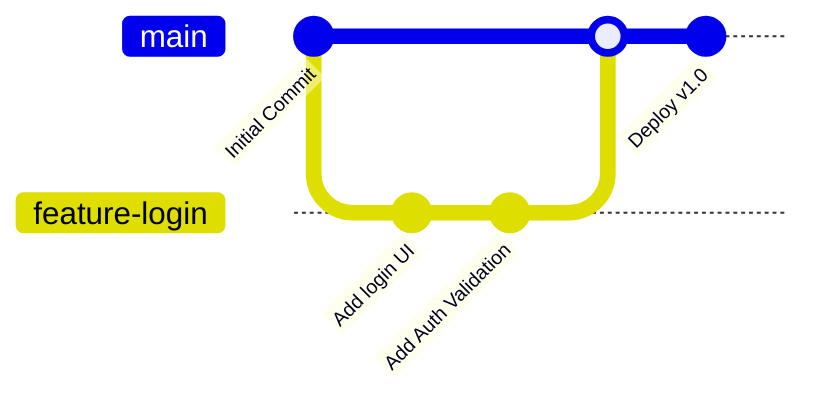
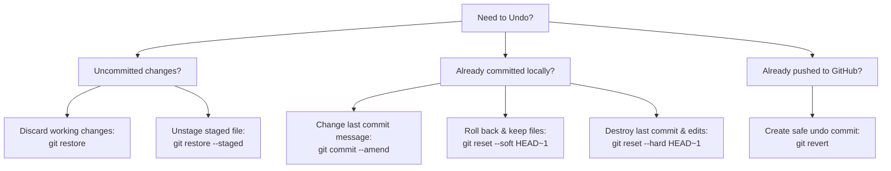

# Git and GitHub Mastery: From Beginner to Expert

Welcome to the ultimate guide to Git and GitHub. This tutorial is structured to take you from absolute beginner concepts to advanced, enterprise-grade workflows.

---

## 🗺️ Git Architecture & Data Flow

To understand Git, you must understand how data moves between different states. Git runs locally on your machine and tracks files across four main areas:



| Area | Description |
| :--- | :--- |
| **Working Directory** | The actual files you see and edit on your computer's filesystem. |
| **Staging Area (Index)** | A preview area where Git prepares the changes to be included in the next commit. |
| **Local Repository** | The `.git` directory containing all committed snapshots, history, and branches on your machine. |
| **Remote Repository** | A hosted version of your project on a platform like GitHub, allowing collaboration. |

---

## 🟢 Level 1: Beginner (Foundations)

### 1. Git vs. GitHub: The Essential Difference

> [!NOTE]
> * **Git** is the local command-line tool that tracks changes and manages version control on your computer.
> * **GitHub** is a cloud-based hosting service that stores your Git repositories online and adds collaboration tools (pull requests, issues, actions).

### 2. Initial Setup
Before writing code, configure your identity. Git attaches this information to every commit you make.

```bash
# Configure username globally
git config --global user.name "Your Name"

# Configure email address globally
git config --global user.email "your.email@example.com"

# Check your configuration list
git config --list
```

### 3. Creating & Cloning Repositories
Start a new project locally, or download an existing one.

* **Definition**: `git init` creates a hidden `.git` directory in the current folder, transforming it into a Git repository.
* **Definition**: `git clone <url>` downloads an entire existing repository (including history and branches) from a remote URL.

```bash
# Initialize a new local repository
git init my-new-project

# Clone a remote repository from GitHub
git clone https://github.com/username/repository.git
```

### 4. The Basic Git Workflow
This is the loop you will run dozens of times a day.



#### Step A: Check Status
```bash
git status
```
* **Explanation**: Displays modified files, untracked files, and files currently in the staging area.

#### Step B: Stage Changes
```bash
# Stage a specific file
git add index.html

# Stage all files and modifications in the current folder
git add .
```
* **Explanation**: Moves files from the Working Directory to the Staging Area.

#### Step C: Commit Changes
```bash
git commit -m "feat: add landing page layout"
```
* **Explanation**: Saves a permanent snapshot of the staged changes to your local database.
* **Example**:
  ```bash
  $ git commit -m "docs: update installation instructions"
  [main 4f1a2b3] docs: update installation instructions
   1 file changed, 12 insertions(+), 2 deletions(-)
  ```

### 5. Inspecting History
```bash
# View chronological list of commits
git log --oneline --graph --decorate --all

# Show changes made in the working directory compared to the last commit
git diff
```

---

## 🟡 Level 2: Intermediate (Branching & Collaboration)

### 1. Branching Basics
Branches allow you to develop features, fix bugs, or experiment in isolation without affecting the stable `main` branch.



* **Definition**: A branch is simply a lightweight pointer to one of your commits.

```bash
# List all local branches
git branch

# Create a new branch named 'feature-login'
git branch feature-login

# Switch to the new branch
git checkout feature-login
# OR (Modern syntax)
git switch feature-login

# Create AND switch to a branch in one command
git checkout -b feature-login
# OR (Modern syntax)
git switch -c feature-login
```

### 2. Merging
Once work on a branch is complete, merge it back into your target branch (usually `main`).

```bash
# 1. Switch to the target branch (main)
git checkout main

# 2. Merge the feature branch into main
git merge feature-login
```

> [!TIP]
> If the destination branch has not diverged (no commits were made to `main` while you worked on `feature-login`), Git performs a **Fast-Forward** merge, simply moving the branch pointer forward. If it did diverge, Git creates a new **Merge Commit**.

### 3. Resolving Merge Conflicts
Conflicts happen when two branches modify the same line of a file, and Git doesn't know which version to keep.

#### Conflict Resolution Walkthrough:
1. Try to merge: `git merge feature-login` -> Git outputs: `CONFLICT (content): Merge conflict in index.html`.
2. Open the conflicted file. You will see conflict markers:
   ```html
   <<<<<<< HEAD
   <h1>Welcome to our Main Portal</h1>
   =======
   <h1>Welcome to the Dashboard</h1>
   >>>>>>> feature-login
   ```
3. **Resolve**: Edit the file manually to keep the desired code. Remove the markers (`<<<<<<<`, `=======`, `>>>>>>>`).
4. Stage the resolved file:
   ```bash
   git add index.html
   ```
5. Commit the merge:
   ```bash
   git commit -m "merge: resolve conflict in index.html, keep dashboard title"
   ```

### 4. Collaboration with Remotes
To work with others on GitHub, you need to sync your local repository with a remote repository.

```bash
# Add a remote link named 'origin'
git remote add origin https://github.com/user/project.git

# Push your local 'main' branch to GitHub (sets tracking link)
git push -u origin main

# Download updates from GitHub but DO NOT merge them
git fetch origin

# Download updates and immediately merge them into your current branch
git pull origin main
```

---

## 🟠 Level 3: Advanced (History Manipulation & Undoing)

### 1. Undoing Mistakes
Git provides safety nets for almost any mistake.



#### Detailed Undo Scenarios:

* **Scenario A: Modify the last commit**
  You committed, but forgot to add a file or made a typo in the commit message.
  ```bash
  git add forgotten-file.js
  git commit --amend -m "feat: complete login functionality with forgotten file"
  ```

* **Scenario B: Resetting commits (`git reset`)**
  * `--soft`: Moves the branch pointer back, but keeps your code changes staged in the Staging Area.
  * `--mixed` (Default): Moves the pointer back, unstages changes, but keeps code in your Working Directory.
  * `--hard`: **Destructive**. Moves pointer back and deletes all changes in Working Directory and Staging Area.
  ```bash
  # Soft reset back by 1 commit
  git reset --soft HEAD~1
  ```

* **Scenario C: Reverting pushed commits (`git revert`)**
  > [!WARNING]
  > Never use `git reset` on commits that have already been pushed to a shared remote repository. It rewrites history and will break the repositories of your teammates. Instead, use `git revert`.

  ```bash
  # Creates a new commit that is the exact inverse of the specified commit
  git revert a1b2c3d4
  ```

### 2. Rebasing vs. Merging
Rebasing is the process of moving or combining a sequence of commits to a new base commit.

```
       A---B---C topic
      /
 D---E---F---G main
```
Rebasing `topic` onto `main` results in:
```
               A'--B'--C' topic
              /
 D---E---F---G main
```

* **Merge**: Preserves history exactly as it happened, including branching timelines. (Creates a merge commit).
* **Rebase**: Rewrites history to make it look like feature development happened sequentially. (Keeps history linear).

```bash
# Switch to feature branch
git checkout feature-login

# Rebase feature branch on top of main
git rebase main
```

### 3. Interactive Rebasing (`git rebase -i`)
Use interactive rebasing to clean up commits before pushing to production. You can combine (squash), edit, delete, or reword commits.

```bash
# Open interactive editor for the last 4 commits
git rebase -i HEAD~4
```
This opens an editor showing:
```text
pick 1a2b3c4 feat: add database migration
pick 5e6f7g8 feat: add login button
pick 9h0i1j2 typo fix
pick 3k4l5m6 fix layout bug

# Rebase commands:
# p, pick = use commit
# r, reword = use commit, but edit the commit message
# e, edit = use commit, but stop for amending
# s, squash = meld into previous commit, combining messages
```
*(By changing `pick` to `squash` on `9h0i1j2`, you can merge the typo fix directly into the login button commit).*

### 4. Stashing Temporary Work
If you are halfway through a feature and need to switch branches to fix an urgent bug, you can save your uncommitted changes without committing them.

```bash
# Save active changes to a temporary storage stack
git stash save "Work in progress login layout"

# Switch branches, fix the bug, commit, and return...
git checkout main
# (bugfix workflow)
git checkout feature-login

# List stashes
git stash list

# Re-apply the stashed changes and remove them from the stash stack
git stash pop
```

---

## 🔵 Level 4: Expert (Enterprise Workflows & GitHub Ecosystem)

### 1. The Reflog: Git's Time Machine
If you run `git reset --hard` and lose commits, or delete a branch by accident, `git reflog` is your last line of defense. It records every single pointer movement in your local repository.

```bash
# View list of all actions performed locally
git reflog
```
Output:
```text
4f1a2b3 HEAD@{0}: reset: moving to HEAD~1
a8b7c6d HEAD@{1}: commit: feat: experimental login method
```
```bash
# Recover the "lost" commit (a8b7c6d) by resetting back to it
git reset --hard a8b7c6d
```

### 2. Git Hooks
Git hooks are scripts that run automatically before or after key Git actions (like commits or pushes). They are located in `.git/hooks/`.

#### Example: Enforcing Pre-commit Linting
Create a file named `.git/hooks/pre-commit` (no file extension):
```bash
#!/bin/sh
# Run code formatter / linter
npm run lint
if [ $? -ne 0 ]; then
    echo "❌ Linting failed. Commit aborted."
    exit 1
fi
```
Make the script executable:
```bash
chmod +x .git/hooks/pre-commit
```

### 3. GitHub Actions (CI/CD)
GitHub Actions allows you to automate workflows directly inside your repository. Workflows are defined in YAML files inside the `.github/workflows/` directory.

#### Example Pipeline: `.github/workflows/test.yml`
```yaml
name: Node.js CI

on:
  push:
    branches: [ main ]
  pull_request:
    branches: [ main ]

jobs:
  build:
    runs-on: ubuntu-latest
    steps:
    - name: Checkout Code
      uses: actions/checkout@v3
      
    - name: Set up Node.js
      uses: actions/setup-node@v3
      with:
        node-version: 18
        
    - name: Install dependencies
      run: npm ci
      
    - name: Run Tests
      run: npm test
```

### 4. Git Bisect: Find the Bug
If a bug was introduced somewhere in your history of 100 commits, `git bisect` uses binary search to pinpoint the exact commit that introduced the bug.

```bash
# Start the bisect wizard
git bisect start

# Tell Git current HEAD is broken
git bisect bad

# Tell Git a commit/tag that was working perfectly
git bisect good v1.0.0

# Git will now checkout the middle commit. You test the code.
# If it's still broken:
git bisect bad
# If it works:
git bisect good

# Git repeats until it prints the exact offender commit!
# Once done, return to your original branch:
git bisect reset
```

---

## ❓ Git & GitHub Interview Questions

### 🟢 Beginner Level

#### Q1: What is the staging area (index) in Git, and why do we need it?
* **Answer**: The staging area is an intermediate preview zone between the working directory and commit history. It allows developers to bundle together only a subset of modified files for a commit, rather than committing all edits at once. This enables clean, single-purpose commits.

#### Q2: What is the difference between `git pull` and `git fetch`?
* **Answer**:
  * `git fetch` downloads references, objects, and commits from the remote repository to your local `.git` directory but does **not** modify your working directory.
  * `git pull` is a combination of two commands: `git fetch` followed immediately by `git merge`. It downloads remote changes and merges them directly into your current active local branch.

---

### 🟡 Intermediate Level

#### Q3: What is the difference between a "fast-forward" merge and a "three-way" (non-fast-forward) merge?
* **Answer**:
  * **Fast-forward merge**: Occurs when the target branch has no new commits since the feature branch was created. Git simply moves the target branch pointer forward to point to the newest commit on the feature branch. No merge commit is created.
  * **Three-way merge**: Occurs when the target branch has diverged (new commits were added to it while the feature branch was developed). Git merges the two tips and their common ancestor, generating a new "merge commit" to tie the histories together.

#### Q4: How do you fix a merge conflict?
* **Answer**:
  1. Identify the conflicted files using `git status`.
  2. Open the files and locate conflict markers: `<<<<<<<`, `=======`, and `>>>>>>>`.
  3. Edit the code manually to choose the desired state, removing the markers.
  4. Stage the files with `git add <file>`.
  5. Commit the merge using `git commit`.

---

### 🔵 Advanced & Expert Level

#### Q5: Explain the difference between `git reset --soft`, `--mixed`, and `--hard`.
* **Answer**:
  * `--soft`: Moves the current branch head to the target commit. The staging area and working directory are left completely untouched. Your modifications remain staged.
  * `--mixed` (default): Moves the branch head to the target commit and resets the staging area to match it. Your files in the working directory remain unchanged but unstaged.
  * `--hard`: Moves the branch head, resets the staging area, and overwrites the working directory to match the target commit. **Warning: Any uncommitted changes are permanently lost.**

#### Q6: When would you use `git rebase` instead of `git merge`? What is the main golden rule of rebasing?
* **Answer**:
  * Use `git rebase` to keep a clean, linear commit history by pulling remote updates under your work-in-progress local commits.
  * Use `git merge` to integrate features while keeping an accurate record of when branches diverged and merged.
  * **Golden Rule of Rebasing**: *Never rebase branches that have been pushed to a public remote repository.* Doing so alters commit histories that other developers might be building upon, leading to severe synchronization conflicts.

#### Q7: How would you recover a commit that was lost due to a `git reset --hard` or deletion of a branch?
* **Answer**:
  By using `git reflog`. Git tracks all changes to branch pointers. Running `git reflog` shows a chronological list of positions HEAD has occupied. Find the commit hash before the destructive operation, and run `git reset --hard <commit-hash>` to restore the repository to that exact state.

#### Q8: What is a detached HEAD state, and how do you resolve it?
* **Answer**:
  * **Detached HEAD** happens when you checkout a specific commit hash or tag directly (e.g., `git checkout a1b2c3d`) instead of a branch pointer. In this state, HEAD points directly to a commit object rather than a branch reference. Any new commits made here do not belong to any branch and will be lost once you switch branches.
  * **Resolution**: To save changes made in a detached HEAD, create a new branch from your current position immediately using `git switch -c new-branch-name`. If you did not make any changes and just wanted to explore, simply checkout your main branch: `git checkout main`.
