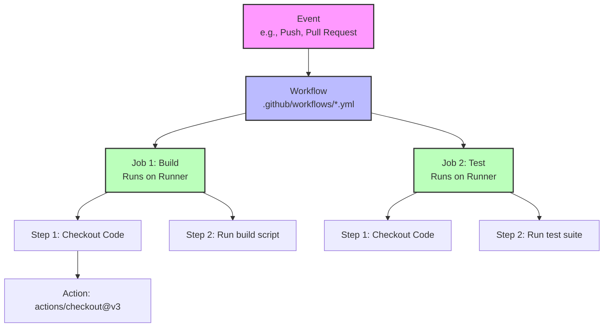

# GitHub Actions Mastery: Automate Your Workflow

Welcome to the comprehensive guide on GitHub Actions. This tutorial will take you from understanding the basic components to building complex CI/CD (Continuous Integration / Continuous Deployment) pipelines.

---

## 🏗️ Core Components & Architecture

GitHub Actions is an automation platform embedded directly in GitHub. It allows you to build, test, and deploy your code right from your repository.



| Component | Description |
| :--- | :--- |
| **Workflow** | A configurable automated process made up of one or more jobs. Defined in a YAML file in the `.github/workflows` directory. |
| **Event** | A specific activity in a repository that triggers a workflow (e.g., `push`, `pull_request`, `schedule`). |
| **Job** | A set of steps that execute on the same runner. Jobs run in parallel by default but can be made sequential. |
| **Step** | An individual task that can run commands (`run`) or an action (`uses`). |
| **Action** | A standalone command that performs a complex, frequently repeated task. You can write your own or use community actions. |
| **Runner** | A server (virtual machine) that runs your workflows when they're triggered. GitHub hosts runners (Ubuntu, Windows, macOS), or you can host your own. |

---

## 🟢 Level 1: Beginner (Hello World)

### 1. Creating Your First Workflow
Workflows live in the `.github/workflows/` directory of your repository. 

Create a file named `.github/workflows/hello-world.yml`:

```yaml
name: Hello World Workflow

# 1. The Event: When should this run?
on: [push]

# 2. The Jobs: What should it do?
jobs:
  say-hello:
    # 3. The Runner: Where should it run?
    runs-on: ubuntu-latest
    
    # 4. The Steps: How should it do it?
    steps:
      - name: Greet the user
        run: echo "Hello, GitHub Actions!"
        
      - name: Print the branch name
        run: echo "This push was on branch $GITHUB_REF_NAME"
```

> [!NOTE]
> Every time someone pushes code to any branch in the repository, GitHub will spin up an Ubuntu virtual machine and execute the `echo` commands.

### 2. Common Triggers (`on`)

* **Push to specific branches:**
  ```yaml
  on:
    push:
      branches: [ "main", "develop" ]
  ```
* **Pull Requests:**
  ```yaml
  on:
    pull_request:
      branches: [ "main" ]
  ```
* **Manual Trigger:** Allows you to run the workflow from the GitHub UI.
  ```yaml
  on:
    workflow_dispatch:
  ```
* **Scheduled Trigger (Cron):** Runs at specific times.
  ```yaml
  on:
    schedule:
      - cron: '0 2 * * 1' # Runs at 02:00 every Monday
  ```

---

## 🟡 Level 2: Intermediate (Real Workflows)

### 1. Using Community Actions
You rarely write everything from scratch. GitHub Marketplace has thousands of pre-built actions.

```yaml
steps:
  # The most important action: Downloads your repository code onto the runner
  - name: Checkout code
    uses: actions/checkout@v3

  # Sets up a specific version of Node.js
  - name: Setup Node.js
    uses: actions/setup-node@v3
    with:
      node-version: '18'
```

### 2. Environment Variables and Secrets
You should never hardcode API keys or passwords in your workflows. Store them in GitHub (Settings > Secrets and variables > Actions).

```yaml
jobs:
  deploy:
    runs-on: ubuntu-latest
    env:
      APP_ENV: production # Normal environment variable
    steps:
      - name: Checkout
        uses: actions/checkout@v3
        
      - name: Deploy to Server
        run: ./deploy.sh
        env:
          API_KEY: ${{ secrets.PRODUCTION_API_KEY }} # Secret variable
```

### 3. Caching Dependencies
Downloading dependencies (like `npm install` or `pip install`) takes time. Caching speeds up your workflows.

```yaml
steps:
  - uses: actions/checkout@v3
  
  # Action specifically for caching
  - name: Cache Node modules
    uses: actions/cache@v3
    with:
      path: ~/.npm
      key: ${{ runner.os }}-node-${{ hashFiles('**/package-lock.json') }}
      restore-keys: |
        ${{ runner.os }}-node-

  - name: Install dependencies
    run: npm ci
```

---

## 🟠 Level 3: Advanced (Matrix & Concurrency)

### 1. Matrix Builds
Want to test your code on multiple operating systems and multiple versions of a language simultaneously? Use a matrix.

```yaml
jobs:
  test:
    runs-on: ${{ matrix.os }}
    strategy:
      matrix:
        os: [ubuntu-latest, windows-latest, macos-latest]
        node-version: [14.x, 16.x, 18.x]
    
    steps:
      - uses: actions/checkout@v3
      - name: Use Node.js ${{ matrix.node-version }}
        uses: actions/setup-node@v3
        with:
          node-version: ${{ matrix.node-version }}
      - run: npm ci
      - run: npm test
```
> [!TIP]
> This single job configuration will fan out and run 9 separate jobs in parallel (3 OS options × 3 Node versions).

### 2. Job Dependencies (`needs`)
By default, jobs run in parallel. Use `needs` to make them sequential.

```yaml
jobs:
  build:
    runs-on: ubuntu-latest
    steps:
      - run: echo "Building..."

  test:
    needs: build # Will wait for 'build' to complete successfully
    runs-on: ubuntu-latest
    steps:
      - run: echo "Testing..."

  deploy:
    needs: [build, test] # Waits for both
    runs-on: ubuntu-latest
    steps:
      - run: echo "Deploying..."
```

### 3. Reusable Workflows
Don't repeat code. You can call one workflow from another.

**In `shared-workflow.yml`:**
```yaml
on:
  workflow_call: # This makes it reusable
    inputs:
      environment:
        required: true
        type: string
```

**In `main-workflow.yml`:**
```yaml
jobs:
  call-shared-workflow:
    uses: ./.github/workflows/shared-workflow.yml
    with:
      environment: 'staging'
```

---

## 🔵 Level 4: Real-World Example (Docker CI/CD)

This is a complete pipeline that builds a Docker image, logs into GitHub Container Registry (GHCR), and pushes the image when code is merged into `main`.

```yaml
name: Build and Push Docker Image

on:
  push:
    branches:
      - main

env:
  REGISTRY: ghcr.io
  IMAGE_NAME: ${{ github.repository }}

jobs:
  build-and-push:
    runs-on: ubuntu-latest
    permissions:
      contents: read
      packages: write # Needed to push to GHCR

    steps:
      - name: Checkout repository
        uses: actions/checkout@v3

      - name: Log in to the Container registry
        uses: docker/login-action@v2
        with:
          registry: ${{ env.REGISTRY }}
          username: ${{ github.actor }}
          password: ${{ secrets.GITHUB_TOKEN }} # Automatically provided by GitHub

      - name: Extract metadata (tags, labels) for Docker
        id: meta
        uses: docker/metadata-action@v4
        with:
          images: ${{ env.REGISTRY }}/${{ env.IMAGE_NAME }}

      - name: Build and push Docker image
        uses: docker/build-push-action@v4
        with:
          context: .
          push: true
          tags: ${{ steps.meta.outputs.tags }}
          labels: ${{ steps.meta.outputs.labels }}
```

---

## ❓ GitHub Actions Interview Questions

### 🟢 Beginner Level

#### Q1: What is a Runner in GitHub Actions?
* **Answer**: A runner is a server that executes the jobs defined in a GitHub Actions workflow. GitHub provides hosted runners (Ubuntu, macOS, Windows environments), or you can host your own self-hosted runners on your own infrastructure for custom requirements or access to internal networks.

#### Q2: What is the `actions/checkout` action, and why is it almost always the first step?
* **Answer**: `actions/checkout` is a community action that downloads a copy of the repository's code onto the runner. Because the runner starts as an empty virtual machine, you must checkout the code before you can build, test, or deploy it.

---

### 🟡 Intermediate Level

#### Q3: How do you pass data securely to a GitHub Action without exposing it in the YAML file?
* **Answer**: You use **GitHub Secrets**. You store the sensitive data (like API keys or deployment passwords) in the repository settings under "Secrets". In the YAML file, you reference the secret using the expression syntax: `${{ secrets.SECRET_NAME }}`. GitHub masks these values in the workflow logs.

#### Q4: What is the purpose of the `GITHUB_TOKEN`?
* **Answer**: The `GITHUB_TOKEN` is a special, automatically generated secret provided by GitHub for every workflow run. It grants the workflow authenticated access to the repository it belongs to. It can be used to perform tasks like pushing code, creating releases, or pulling packages from GitHub Packages, without needing to create a separate Personal Access Token (PAT).

---

### 🔵 Advanced Level

#### Q5: Explain how to share data between different jobs in the same workflow.
* **Answer**: Because jobs run on different runners (or fresh VMs), they do not share a file system. To share data, you must use **Artifacts**. 
  * The first job uses the `actions/upload-artifact` action to upload files (like build outputs or test reports) to GitHub storage.
  * The dependent job uses the `actions/download-artifact` action to pull those files down to its own runner.

#### Q6: How do you prevent multiple deployments from running concurrently and stepping on each other?
* **Answer**: You use the `concurrency` key in the workflow or job definition. By assigning a concurrency group name (e.g., `concurrency: production-environment`), GitHub will ensure that only one job or workflow in that group runs at a time. You can also configure it to automatically cancel pending or currently running jobs in the same group using `cancel-in-progress: true`.

#### Q7: What are Reusable Workflows, and how do they differ from Composite Actions?
* **Answer**:
  * **Reusable Workflows**: Entire workflows (triggered via `workflow_call`) that can be called by other workflows. They can contain multiple jobs, use matrix strategies, and utilize secrets directly. They are great for standardizing complete CI/CD pipelines across an organization.
  * **Composite Actions**: Custom actions (defined in an `action.yml` file) that bundle multiple *steps* into a single step. They run within a single job and are better for reusing small, specific sequences of steps (like a complex setup routine) rather than entire multi-job pipelines.

---

## 🟣 Level 5: Expert & Security (OIDC, Permissions, Debugging)

### 1. Permissions & Principle of Least Privilege
By default, the `GITHUB_TOKEN` has broad permissions. It's a security best practice to restrict its access to exactly what is needed using the `permissions` block.

```yaml
jobs:
  deploy:
    runs-on: ubuntu-latest
    permissions:
      contents: read     # Required to checkout the code
      pull-requests: write # Required to comment on a PR
      issues: none       # Explicitly deny issue access
    steps:
      - uses: actions/checkout@v3
```

### 2. OpenID Connect (OIDC) for Cloud Authentication
Never store long-lived cloud credentials (like AWS Access Keys or GCP Service Account keys) as GitHub Secrets if you can avoid it. Instead, use OIDC to request short-lived, temporary access tokens.

```yaml
permissions:
  id-token: write # Required for OIDC authentication
  contents: read

steps:
  - name: Configure AWS credentials
    uses: aws-actions/configure-aws-credentials@v3
    with:
      role-to-assume: arn:aws:iam::111122223333:role/my-github-actions-role
      aws-region: us-east-1
```
> [!IMPORTANT]
> The cloud provider verifies the identity of the GitHub Action via an OIDC token, ensuring highly secure, credential-less deployments.

### 3. Environments and Protection Rules
You can define "Environments" (e.g., `production`, `staging`) in your repository settings. Environments allow you to configure:
* **Environment Secrets**: Secrets that are only available to jobs targeting that environment.
* **Required Reviewers**: Workflows will pause and wait for manual human approval before proceeding.

```yaml
jobs:
  deploy-to-prod:
    runs-on: ubuntu-latest
    environment: 
      name: production
      url: https://my-app.com
    steps:
      - run: echo "Deploying to prod..."
```

### 4. Debugging Workflows
When a workflow fails inexplicably, you can enable verbose logging.

1. Go to repository **Settings** -> **Secrets and variables** -> **Actions**.
2. Add a new repository secret or variable:
   * `ACTIONS_STEP_DEBUG` set to `true`: Enables detailed step logging.
   * `ACTIONS_RUNNER_DEBUG` set to `true`: Enables diagnostic logging for the runner itself.

> [!TIP]
> **SSH into a runner:** You can use community actions like `mxschmitt/action-tmate` to pause the workflow and open a live SSH/Web shell directly into the runner VM to manually debug issues.

---

### 🟣 Expert Level Interview Questions

#### Q8: What is OIDC (OpenID Connect) in the context of GitHub Actions, and why is it recommended?
* **Answer**: OIDC is an identity protocol that allows GitHub Actions to securely authenticate with cloud providers (AWS, Azure, GCP) without needing to store long-lived, hardcoded credentials as GitHub secrets. It prevents credential leakage, enables automatic token rotation, and enforces strict identity federation rules based on repository names and branches.

#### Q9: How do you securely manage deployments to a production environment that require manual sign-off?
* **Answer**: By creating a GitHub **Environment** (e.g., "Production") in the repository settings and adding **Required Reviewers** to it. In the workflow YAML, the deployment job must declare `environment: Production`. When the workflow reaches that job, it will halt and wait for an authorized user to manually approve the deployment via the GitHub UI.

#### Q10: What happens if two workflows trigger at the exact same time trying to modify the same resource? How do you prevent race conditions?
* **Answer**: By default, they will run in parallel, which can cause race conditions or corrupt state (e.g., Terraform state locks or simultaneous deployments). This is prevented by using the `concurrency` key, assigning both workflows to the same concurrency group. This forces them to run sequentially or allows one to automatically cancel the other.
