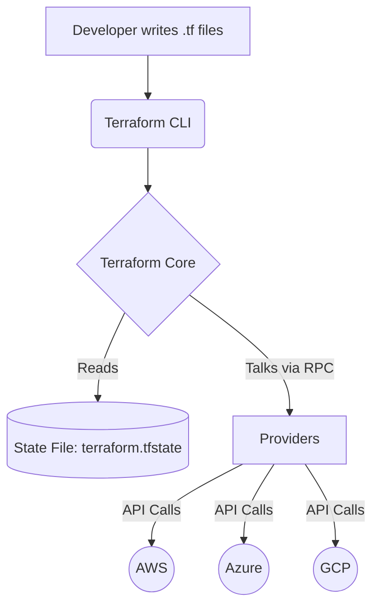

# 🚀 Mastering Terraform: The Ultimate Beginner to Expert Guide

Welcome to the definitive guide for learning **HashiCorp Terraform**. Whether you are just starting your DevOps journey or looking to solidify your advanced infrastructure-as-code (IaC) skills, this colorful and in-depth tutorial has you covered.

---

## 🌟 1. Introduction to Terraform

> [!NOTE]
> **Definition:** Terraform is an open-source Infrastructure as Code (IaC) software tool created by HashiCorp. It allows users to define and provision a datacenter infrastructure using a declarative configuration language known as HashiCorp Configuration Language (HCL), or optionally JSON.

### Why Terraform?
*   **Platform Agnostic:** Works with AWS, Azure, GCP, Kubernetes, and hundreds of other platforms.
*   **Declarative:** You define *what* you want (the end state), and Terraform figures out *how* to get there.
*   **Immutable Infrastructure:** Instead of modifying existing servers, you replace them with new ones, ensuring consistency.

### How Terraform Works



---

## 🟢 2. Beginner Level: The Fundamentals

### Core Concepts

1.  **Providers:** Plugins that interact with cloud platforms (e.g., AWS, Azure).
2.  **Resources:** The most important element. They describe one or more infrastructure objects (e.g., a virtual network, compute instance).
3.  **Variables:** Input parameters to make your code reusable.
4.  **Outputs:** Return values from your Terraform module.
5.  **State (`terraform.tfstate`):** A file where Terraform maps real-world resources to your configuration.

### 🛠️ The Ultimate Terraform Command Reference

Terraform has many commands, but they can be categorized by their purpose in the lifecycle.

#### 1. The Core Workflow (Everyday Commands)
These are the commands you will use 99% of the time.

| Command | Explanation | Example / Usage |
| :--- | :--- | :--- |
| `terraform init` | Initializes a working directory containing Terraform configuration files. Downloads provider plugins and sets up the backend. | `terraform init` |
| `terraform plan` | Creates an execution plan. It shows you exactly what Terraform *will* do without actually making changes to the cloud. | `terraform plan -out=tfplan` |
| `terraform apply` | Executes the actions proposed in a Terraform plan to create, update, or delete infrastructure. | `terraform apply tfplan` |
| `terraform destroy` | Destroys all remote objects managed by a particular Terraform configuration. Use with extreme caution! | `terraform destroy -auto-approve` |

#### 2. Code Formatting & Validation
Always run these before creating a Pull Request.

| Command | Explanation | Example / Usage |
| :--- | :--- | :--- |
| `terraform fmt` | Rewrites Terraform configuration files to a canonical format and style. Keeps code readable and consistent. | `terraform fmt -recursive` |
| `terraform validate` | Validates the configuration files in a directory, checking for syntax errors and internal consistency (without accessing provider APIs). | `terraform validate` |

#### 3. State Management Commands
These commands interact directly with the `terraform.tfstate` file.

> [!WARNING]
> Modifying state directly is dangerous. Always backup your state before using these commands!

| Command | Explanation | Example / Usage |
| :--- | :--- | :--- |
| `terraform state list` | Lists all resources currently tracked in the state file. | `terraform state list` |
| `terraform state show` | Shows the attributes of a single resource in the state file. | `terraform state show aws_instance.web` |
| `terraform state rm` | Removes a resource from the state file (does NOT destroy it in the cloud, just makes Terraform "forget" it). | `terraform state rm aws_instance.web` |
| `terraform state mv` | Moves an item in the state. Useful if you rename a resource block in your `.tf` code but don't want to destroy/recreate the actual server. | `terraform state mv aws_instance.old aws_instance.new` |
| `terraform refresh` | Updates the state file with the real-world infrastructure (note: `apply` does this automatically now). | `terraform refresh` |

#### 4. Advanced & Utility Commands

| Command | Explanation | Example / Usage |
| :--- | :--- | :--- |
| `terraform import` | Brings existing infrastructure (created manually or by other tools) under Terraform's management. | `terraform import aws_instance.web i-1234567890abcdef0` |
| `terraform output` | Reads an output variable from the state file. | `terraform output instance_ip` |
| `terraform taint` | Marks a resource as degraded or damaged. Terraform will destroy and recreate it on the next `apply`. *(Deprecated in v0.15+, use `apply -replace` instead)*. | `terraform taint aws_instance.web` |
| `terraform untaint` | Removes the "tainted" status from a resource. | `terraform untaint aws_instance.web` |
| `terraform workspace` | Manages Terraform workspaces (e.g., dev, prod) within the same configuration directory. | `terraform workspace select dev` |
| `terraform login` | Obtains and saves credentials for a remote host (like Terraform Cloud) to allow CLI integration. | `terraform login` |
| `terraform force-unlock` | Manually unlocks the state if a previous run crashed and left the lock in place. | `terraform force-unlock <LOCK_ID>` |
| `terraform console` | Opens an interactive console for evaluating expressions and variables. Great for debugging functions like `split()` or `merge()`. | `terraform console` |
| `terraform graph` | Generates a visual dependency graph of Terraform resources (can be piped to Graphviz). | `terraform graph \| dot -Tsvg > graph.svg` |

### Your First Configuration (AWS EC2 Instance)

Create a file named `main.tf`:

```hcl
# 1. Define the Provider
provider "aws" {
  region = "us-east-1"
}

# 2. Define a Resource
resource "aws_instance" "my_first_server" {
  ami           = "ami-0c55b159cbfafe1f0" # Amazon Linux 2 AMI
  instance_type = "t2.micro"

  tags = {
    Name = "HelloWorld"
  }
}
```

---

## 🟡 3. Intermediate Level: Structuring & Modularity

Once you understand the basics, you need to manage larger codebases.

### Input Variables and Outputs

Don't hardcode values. Use `variables.tf` and `outputs.tf`.

**variables.tf**
```hcl
variable "instance_type" {
  description = "Type of EC2 instance to provision"
  type        = string
  default     = "t2.micro"
}
```

**outputs.tf**
```hcl
output "instance_public_ip" {
  description = "Public IP address of the EC2 instance"
  value       = aws_instance.my_first_server.public_ip
}
```

### 📦 Terraform Modules & Dashboard Management

Modules are containers for multiple resources that are used together. They are the primary way to package and reuse resource configurations with Terraform. Every Terraform configuration has at least one module, known as its **root module**.

#### 1. Creating a Custom Module (Child Module)
To create a module, simply group your `.tf` files in a dedicated directory. Let's create a module for an S3 bucket.

**Directory Structure:**
```text
my-project/
├── main.tf (Root Module)
└── modules/
    └── s3-website/
        ├── main.tf
        ├── variables.tf
        └── outputs.tf
```

**modules/s3-website/main.tf:**
```hcl
resource "aws_s3_bucket" "website" {
  bucket = var.bucket_name
}
# ... (other resources like bucket policy) ...
```

#### 2. Consuming Your Module (Local Path)
In your root `main.tf`, you call the module using a `module` block and a local path `source`.

```hcl
module "my_static_site" {
  source      = "./modules/s3-website"
  bucket_name = "my-awesome-site-bucket-123"
}
```

#### 3. Managing Modules in the Terraform Dashboard (Terraform Cloud)
When working in enterprise environments, you don't want to copy-paste local modules. Instead, you publish them to the **Private Module Registry** in the Terraform Cloud (or Enterprise) dashboard.

> [!TIP]
> **Why use the Private Registry?** It provides version control, automatic documentation generation, and centralized sharing across all teams in your organization.

**Steps to Publish and Manage:**
1. **GitHub Repository:** Create a new GitHub repository strictly for your module. The naming convention MUST be `terraform-<PROVIDER>-<NAME>` (e.g., `terraform-aws-s3-website`).
2. **Tag a Release:** Terraform Cloud relies on Git tags (like `v1.0.0`, `v1.1.0`) to manage module versions. Push a tag to your repo.
3. **Connect to Terraform Dashboard:**
   * Log into your Terraform Cloud Dashboard.
   * Go to **Registry** > **Publish** > **Module**.
   * Connect your GitHub account and select the `terraform-aws-s3-website` repository.
4. **Consume from the Registry:**
   Once published, the Terraform dashboard gives you a clean UI, autogenerated documentation for inputs/outputs, and instructions on how to use it. You consume it like this:

```hcl
module "s3-website" {
  source  = "app.terraform.io/<YOUR_ORG>/s3-website/aws"
  version = "1.0.0" # You can now pin specific versions!
  
  bucket_name = "prod-website-bucket"
}
```

#### 4. The Public Terraform Registry
You can also use thousands of community modules directly from the public registry (registry.terraform.io).

```hcl
# Consuming a Public Community Module
module "vpc" {
  source  = "terraform-aws-modules/vpc/aws"
  version = "5.0.0"

  name = "my-vpc"
  cidr = "10.0.0.0/16"

  azs             = ["us-east-1a", "us-east-1b"]
  private_subnets = ["10.0.1.0/24", "10.0.2.0/24"]
  public_subnets  = ["10.0.101.0/24", "10.0.102.0/24"]

  enable_nat_gateway = true
}
```

### Remote State and State Locking

> [!IMPORTANT]  
> NEVER store your `terraform.tfstate` file in Git, especially if it contains sensitive data like database passwords!

Instead, use a **Remote Backend** (like AWS S3) combined with a locking mechanism (like DynamoDB) to prevent concurrent executions from corrupting your state.

```hcl
terraform {
  backend "s3" {
    bucket         = "my-terraform-state-bucket"
    key            = "prod/terraform.tfstate"
    region         = "us-east-1"
    dynamodb_table = "terraform-locks"
    encrypt        = true
  }
}
```

---

## 🔴 4. Expert Level: Advanced Configuration

At the expert level, you are writing highly dynamic, DRY (Don't Repeat Yourself) code that integrates seamlessly into CI/CD pipelines.

### Meta-Arguments: `count` and `for_each`

If you need multiple identical resources, don't copy-paste code.

**Using `count` (List based):**
```hcl
resource "aws_iam_user" "users" {
  count = 3
  name  = "user-${count.index}"
}
```

**Using `for_each` (Map/Set based - Recommended):**
```hcl
variable "user_names" {
  type    = set(string)
  default = ["alice", "bob", "charlie"]
}

resource "aws_iam_user" "users" {
  for_each = var.user_names
  name     = each.value
}
```

### Dynamic Blocks

Dynamic blocks allow you to construct repeatable nested blocks (like `ingress` rules in a security group) inside a resource dynamically.

```hcl
variable "ingress_ports" {
  type    = list(number)
  default = [22, 80, 443]
}

resource "aws_security_group" "web_sg" {
  name = "web-sg"

  dynamic "ingress" {
    for_each = var.ingress_ports
    content {
      from_port   = ingress.value
      to_port     = ingress.value
      protocol    = "tcp"
      cidr_blocks = ["0.0.0.0/0"]
    }
  }
}
```

### Data Sources

Data sources allow Terraform to use information defined *outside* of Terraform, or defined by another separate Terraform configuration.

```hcl
# Fetch the latest Amazon Linux 2 AMI dynamically
data "aws_ami" "latest_amazon_linux" {
  most_recent = true
  owners      = ["amazon"]

  filter {
    name   = "name"
    values = ["amzn2-ami-hvm-*-x86_64-gp2"]
  }
}

resource "aws_instance" "app" {
  ami           = data.aws_ami.latest_amazon_linux.id
  instance_type = "t2.micro"
}
```

### Terraform Workspaces

Workspaces allow you to manage multiple states with a single configuration directory (e.g., `dev`, `staging`, `prod`).

*   `terraform workspace new dev`
*   `terraform workspace select prod`

> [!WARNING]
> While useful, HashiCorp officially recommends using separate directories (and state files) over Workspaces for separating environments (Dev vs Prod) to ensure complete isolation.

---

## 💎 5. Best Practices Checklist

*   ✅ **Pin Provider Versions:** Always specify exact provider versions to prevent breaking changes.
*   ✅ **Use Remote State:** Never rely on local state in a team environment.
*   ✅ **Modularize:** Break monolithic files down into logical modules.
*   ✅ **Use `tfsec` or `checkov`:** Scan your Terraform code for security vulnerabilities *before* applying.
*   ✅ **Implement CI/CD:** Automate `terraform plan` on Pull Requests and `terraform apply` on merge.

---

## 🎯 6. Interview Questions & Answers

Prepare for your DevOps / SRE interviews with these categorized questions.

### Beginner Questions

**Q1: What is the difference between Terraform and Ansible?**
> **A:** Terraform is primarily a provisioning tool (Infrastructure as Code) designed to create, modify, and destroy infrastructure (servers, networks, databases). Ansible is primarily a configuration management tool meant to install software, manage files, and configure services on *already existing* servers. While there is overlap, the best practice is using Terraform to build the server and Ansible to configure it.

**Q2: What is the `terraform.tfstate` file?**
> **A:** It is a JSON file where Terraform stores the state of your managed infrastructure. It acts as a database mapping the Terraform configuration (.tf files) to the real-world resources in the cloud provider. It is how Terraform knows what needs to be created, updated, or deleted during the next `plan`/`apply`.

**Q3: How do you preview changes before applying them?**
> **A:** By running `terraform plan`. It reads the current state, compares it to your configuration, and outputs a list of additions (+), modifications (~), and deletions (-) it will perform.

### Intermediate Questions

**Q4: Explain the difference between `count` and `for_each`. Which is better?**
> **A:** Both create multiple instances of a resource. `count` uses an integer and creates a list. If you remove an item from the middle of a list, Terraform may destroy and recreate subsequent resources to fix the index shift. `for_each` uses a map or set of strings, assigning a specific string key to each resource. This makes `for_each` much safer for managing resources like servers or databases because adding/removing an item doesn't disrupt the others. Therefore, `for_each` is generally preferred.

**Q5: What is a Remote Backend, and why do we need State Locking?**
> **A:** A remote backend stores the state file remotely (e.g., AWS S3, Azure Blob Storage) instead of locally. This is essential for team collaboration. State locking (e.g., using a DynamoDB table) ensures that only one team member or CI/CD pipeline can run `terraform apply` at a time. If two people apply simultaneously, the state file could become corrupted.

**Q6: How do you pass data between different Terraform configurations (e.g., passing a VPC ID from a Network project to an App project)?**
> **A:** You can use the `terraform_remote_state` data source to read the outputs of another state file. Alternatively, you can use a provider-specific parameter store (like AWS Systems Manager Parameter Store or HashiCorp Vault) to write outputs from project A and read them via `data` blocks in project B.

### Expert Questions

**Q7: You accidentally deleted a resource manually in the AWS Console, but it is still in your Terraform configuration. What happens on the next `terraform plan`?**
> **A:** During the `plan` phase, Terraform performs a "refresh" by querying the provider's API. It will notice that the resource is missing in the real world but present in the configuration. The plan will show that it intends to **recreate** the missing resource to match the desired state defined in your `.tf` files.

**Q8: Explain what a Null Resource and Provisioners are, and why they should be a last resort.**
> **A:** A `null_resource` does not create anything in the cloud; it acts as a trigger point. Provisioners (`local-exec`, `remote-exec`) run custom scripts or commands locally or on a newly created server. They are considered a "last resort" because Terraform cannot track the state of the actions performed by a script. If a script fails halfway, Terraform doesn't know how to roll it back, breaking the declarative nature of IaC. Cloud-init or tools like Ansible are preferred for instance configuration.

**Q9: How do you handle secrets in Terraform?**
> **A:** Never hardcode secrets in `.tf` files.
> 1. Pass them at runtime using environment variables (`TF_VAR_db_password=...`).
> 2. Fetch them dynamically using data sources from secret managers like AWS Secrets Manager, Azure Key Vault, or HashiCorp Vault.
> 3. Ensure your state file (which will contain the secret in plain text) is stored in a secure remote backend with encryption at rest and strict IAM access controls.

---
*Happy Provisioning! May your plans always be clean and your applies always succeed.* ☁️🛠️
